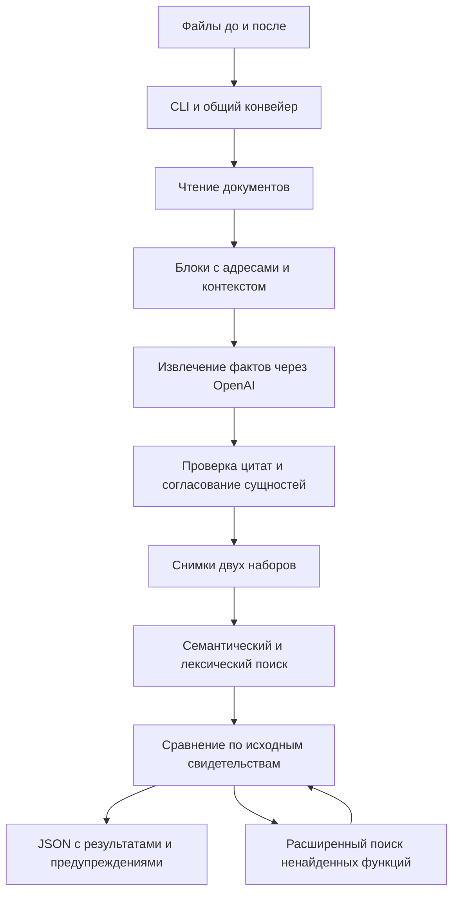

# OrgScope — анализ организационной структуры и функционала

Реализованы **этапы 1–3**: чтение DOCX, текстовых PDF и XLSX, извлечение
подразделений/ролей/функций с проверкой цитат, сопоставление двух наборов и
поиск возможных потерь функций. Доступны контрольные точки CLI `extract` и
`compare`. Проверка дублирования/конфликтов, отчёты, API и интерфейс — следующие
этапы. Python-модуль сохраняет имя `orgdiff`. Для `inspect` ключ OpenAI не нужен.

Из корня репозитория:

```powershell
uv python install 3.12
uv sync --locked
uv run --locked python -m orgdiff inspect --input "../Положение_о_внутреннем_аудите_редакция_8_обезличено.docx" "../Положение_о_внутреннем_аудите_редакция_9_обезличено.docx" --out .artifacts/inspection
uv run --locked pytest -q
```

Результаты: `.artifacts/inspection/documents.json` с исходным текстом, адресами
абзацев/ячеек и предупреждениями; `chunks.json` с блоками `BODY` и контекстом
`CONTEXT`. `read_complete=false` означает, что часть содержимого прочитать не
удалось. Изображения, сканы, вложения и исправления Word требуют отдельной
проверки. Номера страниц Word не вычисляются. Исходные файлы не изменяются.
Содержимое распознанного оглавления помечается как навигация и не передаётся
для извлечения организационных утверждений.

Проверено на двух предоставленных редакциях: 981 исходный блок, 24 фрагмента;
все читаемые блоки и их родительский контекст доступны. В разделе 3.4 сохранены
два пункта перечня до изменения и четыре после. Локальные тесты проверяют
чтение, целостность цитат, области сущностей, кэш и контрольные точки.
Это проверка чтения и структуры текста, не оценка точности AI-анализа.

Секреты и результаты исключены из Git. Для AI-анализа скопируйте
`.env.example` в `.env`, не перезаписывая существующий файл, и заполните ключ:

```powershell
if (-not (Test-Path -LiteralPath .env)) { Copy-Item -LiteralPath .env.example -Destination .env }
```

Переменные окружения имеют приоритет над `.env`. Поддерживаемые настройки
указаны в `.env.example`; дополнительно `BODY_CHARS` (8000) и `CONTEXT_CHARS`
(2000) задают размеры текста фрагментов без служебных меток. При изменении
парсера его версия входит в ключ кэша. Файлы кэша находятся в `.artifacts/cache`.

После заполнения `OPENAI_API_KEY# 1. Название проекта

**OrgScope — анализ организационной структуры и функционала.**

## 2. Краткое описание

OrgScope помогает сотрудникам, анализирующим организационные изменения, сравнивать положения о подразделениях, должностные инструкции и другие документы в редакциях «до» и «после».

Прототип извлекает подразделения, должности, связи и функции, сопоставляет их между наборами документов и выделяет возможные потери функций. Результаты сопровождаются цитатами, чтобы ответственный сотрудник мог проверить вывод по первоисточнику.

## 3. Что реализовано

- Чтение DOCX, текстовых PDF и XLSX с сохранением адресов исходных фрагментов: абзац или ячейка Word, страница PDF, лист и ячейки Excel.
- Обработка нескольких файлов в каждом наборе и исключение повторных загрузок одинакового файла внутри набора.
- Извлечение подразделений, должностей, органов управления, отношений подчинения и атомарных функций с помощью языковой модели.
- Проверка существования источников и точного соответствия цитат с учётом различий в пробелах.
- Сохранение исполнителей, обязанностей, прав, запретов, условий, исключений и периодичности функций.
- Сопоставление сущностей и функций с учётом переименований, переноса ответственности и изменения нумерации пунктов.
- Расширенный поиск ненайденных функций по извлечённым фактам и исходному тексту с одним раундом дополнительного извлечения.
- Сохранение промежуточных результатов, предупреждений, статистики обращений к API и кэша.
- Команды `inspect`, `doctor` и `analyze` с остановкой после извлечения (`extract`) или сравнения (`compare`).
- В отдельной ветке `feature/orgscope-implementation` сделали прототип с фронтендом: локальный запуск сайта с подгрузкой файлов и полным выводом результатов анализа. 

## 4. Как работает решение

1. Пользователь передаёт через командную строку файлы двух наборов: «до» и «после». Принадлежность к набору задаётся явно.
2. Программа читает документы и разбивает текст на фрагменты, сохраняя заголовки и вводные строки списков.
3. Модель извлекает структурированные факты и цитаты. Программа проверяет ссылки, цитаты и внутреннюю согласованность ответа.
4. Семантический и лексический поиск подбирают кандидатов для сопоставления. Модель сравнивает их по исходным свидетельствам в обоих направлениях.
5. Для ненайденных функций выполняется более широкий поиск. Неоднозначные результаты и неполное покрытие отмечаются отдельно.
6. Пользователь получает JSON-файлы с результатами, открывает исходные цитаты и проверяет выводы.

## 5. Технологии

| Компонент | Технологии |
| --- | --- |
| Язык и зависимости | Python 3.12, `uv`, `pyproject.toml`, `uv.lock` |
| Чтение документов | `python-docx`, `pypdf`, `openpyxl` |
| Схемы данных и настройки | Pydantic, `python-dotenv` |
| Извлечение и сравнение | OpenAI Responses API, официальный асинхронный клиент `openai`, модель `gpt-6-luna` |
| Семантический поиск | OpenAI Embeddings API, `text-embedding-3-small`, NumPy |
| Ограничение размера входов | `tiktoken` |
| Хранение | Локальные JSON-файлы и файловый кэш |
| Автоматические проверки | `pytest`, подмена API в тестах |
| Фронтовая оболочка | Streamlit |

Для генерации по умолчанию используются `reasoning.effort=none` и `service_tier=default`. Модели и параметры задаются в конфигурации. FastAPI, Uvicorn и `python-multipart` включены в зависимости для следующего этапа; HTTP API пока не реализован.

## 6. Архитектура проекта



Код находится в `src/orgdiff/`; внутреннее имя Python-модуля — `orgdiff`.

| Модуль | Назначение |
| --- | --- |
| `__main__.py`, `pipeline.py` | Команды CLI, последовательность этапов и сохранение результатов |
| `ingest.py`, `chunking.py` | Чтение файлов, адресация источников и формирование фрагментов |
| `models.py`, `config.py` | Общие схемы данных и настройки |
| `llm.py`, `prompts/` | Вызовы OpenAI, структурированные ответы, повторные попытки и инструкции модели |
| `extract.py` | Проверка цитат, извлечение и согласование сущностей и функций |
| `retrieve.py`, `compare.py` | Поиск кандидатов, сопоставление и проверка возможных потерь |
| `storage.py` | Ключи кэша и атомарная запись файлов |

База данных и отдельный сервер для текущего CLI не требуются. Успешные проверенные ответы и векторы сохраняются в `.artifacts/cache`.

## 7. Установка и запуск

Понадобятся установленный `uv`, доступ к интернету для установки зависимостей и обращений к OpenAI, а для AI-анализа — ключ API с доступом к настроенным моделям и доступной квотой.

Откройте терминал в корне репозитория, рядом с `pyproject.toml`. Установите Python и зависимости:

```powershell
uv python install 3.12
uv sync --locked
```

Создайте `.env`, сохранив существующий файл, если он уже есть:

```powershell
if (-not (Test-Path -LiteralPath .env)) { Copy-Item -LiteralPath .env.example -Destination .env }
```

На Linux/macOS вместо этой команды используйте `test -e .env || cp .env.example .env`. Команды `uv` одинаковы на всех платформах; вручную активировать виртуальное окружение не нужно.

Откройте `.env` в редакторе и заполните `OPENAI_API_KEY`. Основные настройки:

```dotenv
OPENAI_API_KEY=
OPENAI_BASE_URL=https://api.openai.com/v1
OPENAI_MODEL=gpt-6-luna
OPENAI_EMBEDDING_MODEL=text-embedding-3-small
OPENAI_REASONING_EFFORT=none
```

Остальные параметры приведены в `.env.example`. Переменные окружения имеют приоритет над `.env`. Ключ не передаётся через аргументы CLI и не должен попадать в Git.

Проверьте доступ к генерации и embeddings:

```powershell
uv run --locked python -m orgdiff doctor
```

Команда делает небольшие платные запросы и при успехе выводит `LLM: OK`, `Embeddings: OK`, названия моделей и статистику использования.

Запустите сравнение своих файлов:

```powershell
uv run --locked python -m orgdiff analyze --before "before.docx" --after "after.docx" --until compare --out .artifacts/result
```

После `--before` и `--after` можно перечислить несколько путей. Для сохранения только извлечённых фактов замените `--until compare` на `--until extract`.

## 8. Как проверить решение

Для повторения сценария нужны две предоставленные редакции положения о внутреннем аудите. В командах ниже они расположены в родительской папке репозитория; при другом расположении замените пути.

Сначала выполните локальные тесты и чтение документов. Эти команды не обращаются к OpenAI:

```powershell
uv run --locked pytest -q --basetemp .artifacts/pytest
uv run --locked python -m orgdiff inspect --input "../Положение_о_внутреннем_аудите_редакция_8_обезличено.docx" "../Положение_о_внутреннем_аудите_редакция_9_обезличено.docx" --out .artifacts/inspection
```

В `.artifacts/inspection/documents.json` доступны исходные блоки и предупреждения; в `chunks.json` — фрагменты с пометками `BODY` и `CONTEXT`.

После настройки ключа выполните проверку подключения и анализ:

```powershell
uv run --locked python -m orgdiff doctor
uv run --locked python -m orgdiff analyze --before "../Положение_о_внутреннем_аудите_редакция_8_обезличено.docx" --after "../Положение_о_внутреннем_аудите_редакция_9_обезличено.docx" --until compare --out .artifacts/demo
```

| Файл в `.artifacts/demo` | Что проверить |
| --- | --- |
| `before.snapshot.json`, `after.snapshot.json` | Исходные блоки, сущности, отношения, функции, исполнители и полнота извлечения |
| `comparison.json` | Соответствия подразделений и функций, изменения и возможные потери |
| `sources.json` | Исходные тексты для проверки цитат по идентификаторам блоков и стороне сравнения |
| `run.json` | Состояние запуска, настройки без ключа, ошибки и остановка после `compare` |
| `usage.json` | Число обращений к API, попаданий в кэш и использованных токенов |

Для ручной проверки сопоставьте результат с разделом 3.4: ДНМ и ДККМ присутствуют в обеих редакциях, а ДИТААД и ДОА дополнительно включены в перечень новой редакции. Затем проверьте сопоставление обязанности по подготовке предложений из старого пункта 5.3.2 с новым 5.3.3, включая изменение исполнителя. Это критерии проверки живого анализа, а не утверждение, что качество модели уже подтверждено.

У каждой функции должно быть соответствие или явная отметка о ненайденном/неопределённом результате. Проверьте цитаты для каждого вывода, используемого в демонстрации. Повторите ту же команду: успешные неизменившиеся запросы должны переиспользоваться из кэша, что отражается в `usage.json`.

При реализации этапов 1–3 прошли 22 локальных теста. Живое извлечение и сравнение этих редакций пока не проверены: доступный тогда запуск `doctor` сообщил об отсутствии настроенного `OPENAI_API_KEY`.

## 9. Данные и интеграции

Входные данные — документы, переданные пользователем: положения о подразделениях, должностные инструкции, организационные структуры в поддерживаемом текстовом представлении и приложения к распорядительным документам.

Единственная используемая внешняя интеграция — OpenAI API. Фрагменты документов и контекст передаются для извлечения и сравнения, а описания функций и текстовые окна — для вычисления embeddings. Для обоих API используется один ключ. Генеративные запросы отправляются с `store=False`.

Исходные файлы не изменяются. Извлечённый текст, результаты и кэш сохраняются локально в каталоге артефактов. `.env` и `.artifacts/` исключены из Git. Обучение моделей, разметка корпуса и загрузка локальных весов не требуются. Поиск по внешним нормативным базам и интеграции с корпоративными системами пока отсутствуют.

## 10. Ограничения

- Реализованы чтение, извлечение и сравнение. Проверка дублирования и конфликтов интересов, итоговый аналитический отчёт, HTTP API и пользовательский интерфейс ещё не реализованы.
- Изображения, сканированные страницы, графические оргсхемы, вложенные объекты и неподдерживаемые исправления Word могут приводить к неполному покрытию. OCR отсутствует. Старые форматы DOC и XLS не поддерживаются.
- Для Word сохраняются адреса абзацев и ячеек, а не номера страниц. Формулы Excel без сохранённого значения не вычисляются.
- Проверка наличия цитаты подтверждает целостность ссылки, но не гарантирует правильность интерпретации или полноту извлечения модели.
- Ненайденная функция означает, что соответствие не обнаружено в предоставленном наборе после ограниченного поиска. Это не доказывает юридическое упразднение функции или подразделения.
- Неоднозначные соответствия, неразрешённые зависимости и пары, чьи свидетельства не помещаются в заданный лимит, остаются `unresolved`. Неполное извлечение не считается достаточным основанием для вывода об отсутствии функции.
- `extract` и `compare` — промежуточные этапы: в `run.json` сохраняется `pipeline_completed=false`, а непроверенные категории рисков имеют статус `not_run`.
- Для анализа необходимы доступ к OpenAI и платная квота. Прототип не имеет подтверждённых показателей точности и не рассчитан на многопользовательскую промышленную эксплуатацию.

**AI-выводы носят рекомендательный характер и должны быть проверены ответственным сотрудником.**

## 11. Ссылка на deployed-версию

Развёрнутая версия отсутствует. Текущий прототип запускается локально через CLI по инструкции выше.
` в `.env`:

```powershell
uv run --locked python -m orgdiff doctor
uv run --locked python -m orgdiff analyze --before "../Положение_о_внутреннем_аудите_редакция_8_обезличено.docx" --after "../Положение_о_внутреннем_аудите_редакция_9_обезличено.docx" --until extract --out .artifacts/demo
uv run --locked python -m orgdiff analyze --before "../Положение_о_внутреннем_аудите_редакция_8_обезличено.docx" --after "../Положение_о_внутреннем_аудите_редакция_9_обезличено.docx" --until compare --out .artifacts/demo
```

`doctor` и анализ выполняют платные запросы OpenAI: `gpt-6-luna`,
`reasoning=none`, стандартный тариф; embeddings — `text-embedding-3-small`.
Выбранные фрагменты документов передаются провайдеру. Локальные веса не скачиваются.
Успешные проверенные ответы и векторы переиспользуются из кэша.

`extract` сохраняет `before.snapshot.json`, `after.snapshot.json`, `sources.json`,
`run.json`, `usage.json`; `compare` дополнительно создаёт `comparison.json`.
В снимках есть исходные блоки, сущности, связи, функции, ошибки фрагментов и
неразрешённые ссылки. В `run.json` сохраняются конфигурация без ключа, остановленный
этап и состояние; `pipeline_completed=false` для обеих контрольных точек.
`usage.json` содержит обращения к API, попадания в кэш и токены по этапам.

Ненайденная функция означает только отсутствие соответствия в предоставленном
наборе после ограниченного расширенного поиска; это не доказательство упразднения.
Неполное покрытие, неоднозначность или превышение лимита свидетельств остаются
`unresolved`. Категории рисков до этапа 4 имеют состояние `not_run`.
AI-выводы носят рекомендательный характер и требуют проверки ответственным сотрудником.

Проверки этапов 2–3 выполнены без платных вызовов, с подменой API в тестах.
Живая проверка разделов 3.4 и 5.3 ещё не выполнена: при реализации `doctor`
сообщил об отсутствии настроенного `OPENAI_API_KEY`.

Ниже сохранён шаблон организатора для заполнения на заключительном этапе.

1. Название проекта
2. Краткое описание — какую проблему решает проект и для кого.
3. Что реализовано — основные функции и возможности решения.
4. Как работает решение — кратко опиши основной пользовательский сценарий от
входных данных до результата.
5. Технологии — языки, фреймворки, библиотеки, AI-модели, API и внешние
сервисы.
6. Архитектура проекта — основные компоненты и как они взаимодействуют.
7. Установка и запуск — пошаговая инструкция с необходимыми командами.
8. Как проверить решение — пример сценария, который может повторить жюри.
9. Данные и интеграции — какие источники данных, API или внешние сервисы
используются.
10. Ограничения — что не реализовано или какие ограничения есть у текущей
версии.
11. Ссылка на deployed-версию, если она существует.

